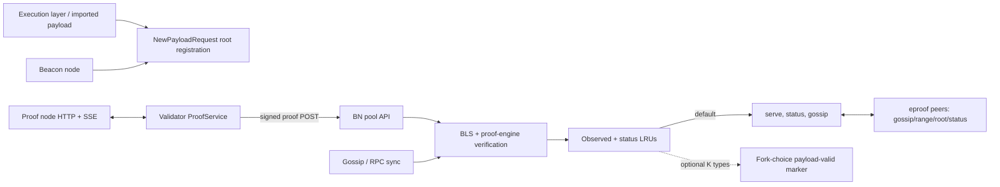
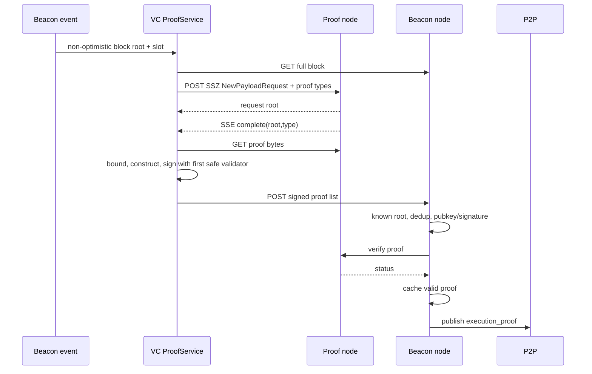

# Phase 2: Lighthouse EIP-8025 Implementation Analysis

## Phase record

- Phase: 2 — Lighthouse implementation analysis.
- Sources: EIPs `feat/eip8025` at `3aa6b30641ef8f98f8945b29ee92c1e8aed1070a`; consensus-specs `master` at `8c12caee279d77b322446d33440b37479117dcde`; Lighthouse `optional-proofs-unstable` at `0dd6c3b8cf3b1eece82a0a7ee87282a222d93bf5`; Grandine `develop` at `d8adce56ed2a324c5abd72af8c0ff94a492ae7d3` (revision recorded only; Grandine was not analyzed).
- Lighthouse range: `494b00a3491e2c5e281f6972aa00694b17f16722..0dd6c3b8cf3b1eece82a0a7ee87282a222d93bf5` (seven commits, 109 files, 18,923 insertions, 251 deletions).
- Caveats: all source worktrees were clean at phase start. The EIP and feature specs are WIP and mutually inconsistent. Focused tests required a separate writable Cargo home/target under the analysis directory; results are in the validation log.
- Inputs: all Phase 1 reports/evidence, live EIP, live feature specs, selected Lighthouse diff, code, call sites, and tests.
- Outputs: this report and updates to the Lighthouse symbol index, discrepancy matrix, and validation log.

## 1. Executive summary

**Verified Lighthouse fact:** Lighthouse implements a broad, end-to-end optional-proof prototype: CL proof types; proof-node HTTP/SSE integration; payload/request-root registration; BLS and proof-engine verification; bounded in-memory observation/status caches; gossip; by-range, by-root and status RPCs; proof catch-up; ENR capability; VC proof generation/signing/publication; configuration; metrics; and mock/zkBoost integration suites.

It is a hybrid rather than a faithful implementation of either written source. Its fixed SSZ `VariableList` has a 1,376,256-byte (1,344 KiB) bound, its domain is the EIP's `0x0D`, and its `PublicInput` is the consensus feature's root-only form. It fixes quorum to one only as a type constant, while the actual fork-choice promotion threshold is operator-configurable and disabled by default.

The default path is supplementary: proofs are verified, cached, served, and propagated without changing block validity. However, `--execution-proof-quorum K` explicitly lets `K` distinct proof *types* mark an execution payload valid in fork choice. **Open specification question:** this conflicts with the EIP's categorical statement that proofs do not affect fork choice and validators use the EL result. It is a non-default Lighthouse experiment, not a protocol requirement.

Important incompleteness remains. Lighthouse checks that the validator index exists but does not check validator activity at the proof's/current epoch. Proof bytes and status are memory-only LRU/hash-map state, not durable canonical retention. Cache pruning to finality is not wired for the status cache. The VC subscribes to ordinary block events, skips optimistic blocks, fetches a full block, and constructs the pre-Gloas request; it does not implement the consensus feature's Gloas envelope/bid prover flow. Proof sync was recently reverted/minimized and has focused helper coverage but little end-to-end negative coverage.

## 2. Scope and evidence

Only the Phase 1-selected branch-local range is attributed to this implementation. All 41 Direct files were inspected; the 68 Supporting files were accounted for as wiring, configuration, dependencies, CI, documentation, simulation, fixtures, or test infrastructure. Unchanged Lighthouse infrastructure (fork-choice APIs, block stores, canonical slot lookup, libp2p plumbing, validator duties, EL new-payload flow) is contextual, not branch-introduced.

Evidence categories used below are **EIP statement**, **Consensus-spec requirement**, **Verified Lighthouse fact**, **Cross-client inference**, and **Open specification question**. This phase makes no Grandine factual claims or proposed changes.

## 3. Requirements mapped to Lighthouse

| Requirement ID | Requirement | Lighthouse status | Paths and symbols | Notes |
|---|---|---|---|---|
| EIP8025-SCOPE-001 | Optional and supplementary | Different | `chain_config.rs:117-145`; `proof_status.rs:249-485` | Default is metadata-only; optional quorum can promote fork-choice payload validity. |
| EIP8025-ROLE-001 | Generator/verifier roles | Implemented | BN/VC CLI/config; `ProofService` | BN verifier and VC generator are independently endpoint-enabled. |
| EIP8025-TYPE-001 | `ProofType: uint8` | Implemented | `types/.../eip8025.rs:33` | Proof engine additionally recognizes a local enum/registry. |
| EIP8025-TYPE-002 | Signed container | Implemented | same:80-87 | Message, validator index, signature. |
| EIP8025-TYPE-003 | Proof container | Different | same:19-70 | Fixed bounded list, but 1,344 KiB rather than 400 KiB or 4 MiB progressive. |
| EIP8025-TYPE-004 | Public input | Different | same:51-53 | Root only; follows consensus feature, not EIP result/config fields. |
| EIP8025-CONSTANT-001 | 400 KiB | Different | same:19-27,348 | Exactly 1,376,256 bytes. |
| EIP8025-CONSTANT-002 | Four types/payload | Implemented | same:30,36 | Used in request types and response bounds. |
| EIP8025-DOMAIN-001 | Domain | Implemented vs EIP; different vs feature | same:39; `compute_execution_proof_domain` | `0x0D000000`, fork-version/genesis-root domain. |
| EIP8025-HASH-001 | Request tree root | Implemented | `NewPayloadRequest::to_owned`; `request_root`; payload registration | Both pre-Gloas block and Gloas envelope construction exist. |
| EIP8025-HASH-002 | Signing root | Implemented | `compute_signing_root`; validator-store signing | SSZ object root plus execution-proof domain. |
| EIP8025-ENGINE-001 | Verify | Implemented | `ProofNodeClient::verify_proof`; `HttpProofEngine` | HTTP returns `ProofStatus`; one-second default timeout. |
| EIP8025-ENGINE-002 | Notify accepted payload | Partial/different | `execution_payload.rs`; payload notifier; request-root registration | Registers request roots; proof-node `notify_new_payload` is not a separate exposed call. |
| EIP8025-ENGINE-003 | Forkchoice notification | Not found | execution-layer EIP-8025 modules | No proof-node head/safe/finalized notification found. |
| EIP8025-ENGINE-004 | Request proofs | Implemented | `request_proofs[_ssz]`; `ProofService` | Returns request root; VC correlates SSE by root/type. |
| EIP8025-VALIDATION-001 | Guest/success/root/config | Partial | proof-engine verify; root resolution | Root is bound; guest is proof-node-specific; success/config cannot be represented. |
| EIP8025-VALIDATION-002 | Existing active validator | Partial | `verify_and_observe_execution_proof:350-360` | Index/pubkey existence checked; active status is not checked. |
| EIP8025-VALIDATION-003 | Signature | Implemented | `verify_signed_execution_proof_signature` | Uses fork at payload slot, not explicitly current epoch. |
| EIP8025-VALIDATION-004 | Non-empty/bounded | Implemented | signature verifier; SSZ list | Empty rejected; oversize fails construction/SSZ decode. |
| EIP8025-VALIDATION-005 | Dedup | Implemented/different | `ObservedExecutionProofs` | Tracks valid payload/type, validator attempts, and invalid type/data-root; duplicates may return Accepted with zero count. |
| EIP8025-VALIDATION-006 | Quorum | Different | `ExecutionProofQuorumConfig`; `try_mark_proof_backed_payload_valid` | Disabled by default; K counts distinct proof types, not validators/proofs. |
| EIP8025-TRANSITION-001 | No on-chain mutation | Implemented | proof path outside state processing | Only caches and optional fork-choice payload status change. |
| EIP8025-FORKCHOICE-001 | No proof effect | Different when flag enabled | `try_mark_proof_backed_payload_valid` | Default compatible; flag violates categorical invariant. |
| EIP8025-LIVENESS-001 | Never await proofs for attestation | Implemented | detached VC service/network handlers; ordinary EL remains | No proof wait in proposer/attester services. |
| EIP8025-STORAGE-001 | Canonical finalized-to-head retention | Partial | `ExecutionProofStatusCache`; range serving | Memory-only bounded caches; no durable DB; canonical lookup at serve time; incomplete pruning. |
| EIP8025-GOSSIP-001 | Global topic | Implemented | pubsub/topics/router/gossip processor | Enabled only with proof endpoint; normal validation result and penalties. |
| EIP8025-RPC-001 | By range | Implemented | RPC methods/codecs/handler | Canonical slots, finalized-start/head window, optional types, chunked proofs. |
| EIP8025-RPC-002 | By root | Implemented | RPC methods/codecs/handler | Filters requested roots/types; partial responses. |
| EIP8025-RPC-003 | Status | Implemented | methods, sync manager/context, `ProofSync` | Advertises latest slot/root and configured types; “sufficient” means any configured valid type locally. |
| EIP8025-RPC-004 | Bounds | Implemented | methods/protocol/codec/rate limiter | SSZ and response caps wired; range encoding had a dedicated fix commit. |
| EIP8025-DISCOVERY-001 | `eproof` ENR | Implemented | `discovery/enr.rs:33,54,108,310` | Presence encoded when BN proof networking is enabled. |
| EIP8025-PROVER-001 | Event/fetch/request/sign/gossip | Partial/different | `ProofService` | Full pre-Gloas block event flow; first safe validator signs; no envelope/bid flow. |
| EIP8025-EL-001 | Stateless private/public I/O | Not applicable/not found | external zkBoost harness only | Lighthouse delegates guest semantics and public-output binding to the proof node. |
| EIP8025-EL-002 | Witness content and stateless validation | Not applicable/not found | zkBoost fixture only | No Lighthouse guest/witness implementation is introduced by the branch. |
| EIP8025-EL-003 | Guest payload validation and false result | Not applicable/not found | proof-node `verify_proof` abstraction | The boolean/status outcome is external; Lighthouse cannot inspect EIP result/config fields. |
| EIP8025-EL-004 | Transaction public-key optimization checks | Not applicable/not found | no branch-local implementation | Execution guest responsibility is outside the Lighthouse client branch. |
| EIP8025-EL-005 | Host request/witness construction | Not applicable/not found | zkBoost integration fixtures/harness | Harness interoperability is static test evidence, not an implementation of the specified host. |
| EIP8025-SSZ-001 | EL private-input schema prefix | Not applicable/not found | no branch-local implementation | Lighthouse implements CL wire SSZ only; proof-node private encoding is opaque. |
| EIP8025-SSZ-002 | EL payload/witness/config/key bounds | Not applicable/not found | no branch-local implementation | No EL guest/private-input bound enforcement exists in this branch. |
| EIP8025-ACTIVATION-001 | Dynamic opt-in/no fork | Partial | BN/VC endpoint flags; network enable bit | No new fork; runtime startup configuration, not demonstrated hot toggling. Gloas and pre-Gloas request paths coexist. |
| EIP8025-API-001 | Events/APIs | Implemented client-specifically | proof-node HTTP/SSE; `/eth/v1/beacon/pool/execution_proofs` | BN route validates before gossip; proof-node URLs are Lighthouse/zkBoost choices. |
| EIP8025-TEST-001 | Conformance | Partial | unit, simulator, proof-engine, zkBoost, CI | Strong happy-path client tests; no upstream feature vectors and notable negative/boundary gaps. |
| EIP8025-SECURITY-001 | DoS bounds/rate limits | Partial | SSZ bounds, RPC quotas, dedup, peer penalties | Large non-normative limit; proof-engine verification occurs before global valid dedup races fully settle. |
| EIP8025-SECURITY-002 | Consensus containment | Different when quorum enabled | chain config/proof status | Default contained; explicit experimental escape hatch. |

## 4. Architecture and functional areas

Functional-area result:

- Protocol types, SSZ/tree hash, constants, config, proof-node transport, validation, gossip/RPC, sync, API, VC, metrics, CLI, CI, simulation and tests are changed.
- State schema, block schema, fork upgrades, proposer/attester duties, slashing, operation pool, consensus state transition, database schema, and consensus fork-choice weighting are unchanged. The optional local quorum calls existing fork-choice payload-valid APIs but adds no weight rule.
- No proof-specific block production field exists. Payload import only registers request context and may receive a proof-backed status in the Gloas notifier.

## 5. Relevant file analysis

### Types and execution/proof-node boundary

`consensus/types/src/execution/eip8025.rs` owns the SSZ/tree-hash wire model and helper accessors. `ProofData` is a `VariableList`; oversize data cannot be constructed or decoded. Signed proof roots cover the complete root-only message and validator attribution/signature container behaves normally.

`NewPayloadRequest::to_owned` removes borrowed payload lifetimes so the request can be SSZ-encoded and tree-hashed independently. The execution layer holds an optional `HttpProofEngine`. `ProofNodeClient` abstracts request, verify, get-proof, and SSE; its HTTP implementation uses SSZ request bodies/proof bodies and JSON/status responses. Transport, non-2xx, malformed SSZ, unknown proof type, timeout, and proof-node RPC errors become `ProofEngineError`.

### Beacon-chain validation and caches

`ExecutionProofStatusCache` maintains bidirectional request/block LRUs (8,192 each), a proof LRU keyed by `(block_root, proof_type)` (8,192), and an unbounded-by-constructor status `HashMap`. It records one proof per block/type; later same-type proof overwrites bytes while the distinct-type count is unchanged. It is not persisted.

`ObservedExecutionProofs` is the cheap anti-duplication layer: known valid request/type, validator attempt per request/type, and invalid `(type, data-root)` are distinguished. Its `prune(finalized_slot)` exists, but no branch-local call site was found. The status cache likewise has no explicit finalized pruning.

`verify_and_observe_execution_proof` resolves a known request, records the validator attempt, resolves the registry pubkey, verifies non-empty bytes and BLS signature, calls the proof engine, and records only `Valid`. Unknown roots become `Syncing` without expensive verification. Engine `Invalid` is cached by proof-data root; `Syncing`/`NotSupported` remain non-valid statuses. No beacon state is loaded to test validator activation.

### Networking and sync

The execution-proof gossip topic is a core proof-enabled topic. Gossip maps valid/accepted to Accept, unknown/not-supported to Ignore, and cryptographic/shape invalidity to Reject plus low-tolerance penalty. Operational failures (missing EL, proof-node failure, missing context) are ignored, avoiding peer punishment for local failure.

RPC types cover range `(start_slot,count,proof_types)`, root identifiers, and status. Codec branches enforce SSZ-snappy bounds; rate limiter entries and response termination variants are wired through service/router/processor layers. Serving checks the finalized-epoch start through current/head window and uses canonical `block_root_at_slot`; skipped slots yield nothing.

`ProofSync` handshakes proof-aware peers, caches their supported types/latest slot, computes local gaps, filters to the serving window, chooses by-range for dense/cheaper gaps or by-root otherwise, allows one request at a time, and cools down after termination. Incoming proofs use the same full verification path. It is catch-up only and does not affect ordinary chain sync completion.

### Validator and API path

The VC service reconnects both SSE streams, tracks requests for five minutes, skips execution-optimistic blocks, requests configured types, correlates root/type events, bounds proof bytes, signs with the first doppelganger-safe voting key, posts to a beacon node, and removes completed/failed types. Signing uses the request block's epoch and standard local/remote signer plumbing; a counter records signed proofs. There is no assignment strategy across validators and no explicit active-at-current-epoch check.

The BN pool API rejects no-engine and empty-list requests, verifies each proof, publishes only newly useful valid/accepted proofs, and returns per-item statuses or indexed failures. It is not an operation-pool insertion despite the URL name.

### Supporting changes

Builder/environment fields instantiate caches and mock proof engines. CLI/config/book changes expose proof endpoint/types/quorum. Network globals/config advertise capability and subscribe routes. Common `eth2` adds the VC HTTP call. Simulator/test builders create generator/verifier topologies. Cargo/Makefile/CI changes build isolated proof and zkBoost jobs. Local-testnet YAML/scripts provide mock and GPU variants. These support Direct code and introduce no separate protocol rule.

## 6. End-to-end happy path

1. A BN with `--proof-engine-endpoint` imports/accepts a payload and registers the SSZ new-payload request root against its beacon block root and slot.
2. A VC with its own proof endpoint receives a non-optimistic block event, fetches the full block, constructs the request, asks for configured proof types, and records the returned root.
3. On proof-node completion SSE, it fetches bounded bytes, builds the root-only `ExecutionProof`, selects its first safe validator, computes the fork-domain signing root, signs, and submits it to the BN pool API.
4. The BN recognizes the request root, applies dedup, resolves the validator pubkey, rejects empty data, verifies BLS, and asks its proof node to verify the cryptographic proof.
5. On `Valid`, the BN caches proof/status, accepts the API item, publishes gossip, and serves it by range/root. Peers repeat the same validation and cache it.
6. Proof-aware peers exchange status; a lagging verifier requests missing canonical proofs. Default behavior ends at metadata/cache. Only explicitly configured quorum may promote payload validity.

## 7. Failure and rejection paths

| Condition | Stage | Function | Result | Criticality | Test |
|---|---|---|---|---|---|
| Unknown request root | preliminary | `resolve_execution_proof_block_root` | `Syncing`; gossip ignore | medium | integration behavior; focused negative gap |
| Mismatched block hint/root | context | same | `UnknownRequestRoot` error | high | no direct named test found |
| Duplicate valid type | dedup | `ObservedExecutionProofs::check` | Accepted/no verify | low | `ignore_2_valid_proof_dedup` |
| Repeat validator attempt | dedup | same | Accepted/no verify | medium | observation unit coverage |
| Previously invalid bytes/type | dedup | same | Invalid/reject | medium | invalid data-root tests |
| Empty proof | signature | verifier | `EmptyProofData`; reject/penalize | high | `test_verify_empty_proof_data` |
| Oversize proof | decode/construction | `VariableList`/codec/VC | decode or construction failure | high | max constant/codec length tests; exact boundary gap |
| Bad index/pubkey/signature | BLS | verifier | error; reject/penalize | high | signature/pubkey tests; index gap |
| Inactive validator | eligibility | absent | accepted if signature/engine valid | high | no coverage; implementation gap |
| No local EL/proof engine | operational | verifier/API | error; gossip ignore/API 500 | low consensus, high availability | indirect |
| Proof engine Invalid | engine | verify path | Invalid, cache bytes root, reject/penalize | high | proof-engine suites cover verification; gossip negative gap |
| Engine Syncing/NotSupported | engine | verify path | ignore/no valid cache | low | client status tests partial |
| Proof event unknown/stale | VC | `handle_proof_engine_event` | silently ignored | low | lifecycle suites |
| Optimistic block | VC event | monitor | skipped | liveness-safe | no focused named test |
| No safe validator | VC signing | completion handler | warn/drop | medium | no focused test |
| RPC outside serve window | RPC handler | window check | invalid request/error response | medium | helper/boundary coverage partial |
| Peer invalid RPC proof | RPC receive | processor | penalize; no propagation | medium | simulator negative gap |

## 8. Data structures, SSZ, and hashing

- `ProofType = u8`; local proof-node enum currently constrains configured names/values, so dynamic social registration is not fully generic at the engine boundary.
- `ProofData = List[byte, 1_376_256]`; fixed SSZ offset/list semantics, not progressive SSZ.
- `PublicInput = {new_payload_request_root}`.
- `ExecutionProof = {proof_data, proof_type, public_input}`; `SignedExecutionProof = {message, validator_index:u64, signature}`.
- Range/root/status request containers use bounded SSZ lists derived from four proofs per requested payload and existing request-block caps. Commit `70396010d` corrected range request SSZ encoding.
- `request_root = hash_tree_root(owned NewPayloadRequest)`. Pre-Gloas construction comes from a full beacon block; Gloas construction joins blinded block and signed payload envelope, including versioned hashes where applicable.
- `signing_root = hash_tree_root(SigningData{object_root: hash_tree_root(ExecutionProof), domain})`; domain is `0x0D || fork_data_root[0..28]`.
- No proof is included in block/state roots, signing domains other than its own, database columns, or fork digests. ENR capability and gossip topic use existing fork/network framing.

## 9. Validation and state transition

| Rule or condition | Requirement ID | Path and symbol | Stage | Error or result | Criticality | Tests | Duplicate validation |
|---|---|---|---|---|---|---|---|
| Request root resolves to registered payload context | EIP8025-VALIDATION-005 / EIP8025-HASH-001 | `proof_status.rs::resolve_execution_proof_block_root` | Preliminary | `Syncing` for unknown root; `UnknownRequestRoot` for inconsistent hint | High | Integration behavior; direct mismatch test gap | Rechecked by cache lookup before observation |
| Payload/type already valid or validator already attempted | EIP8025-VALIDATION-005 | `observed_execution_proofs.rs::check` | Preliminary dedup | `Accepted` short-circuit with no engine work | Medium | Observation unit tests; `ignore_2_valid_proof_dedup` | Status cache separately enforces one stored proof per block/type |
| Previously invalid proof type/data root | EIP8025-VALIDATION-005 | `ObservedExecutionProofs`; `verify_and_observe_execution_proof` | Preliminary dedup | `Invalid`; gossip rejects | Medium | Invalid-data-root unit tests | Proof engine establishes invalidity on first attempt |
| Proof bytes fit SSZ maximum | EIP8025-VALIDATION-004 / EIP8025-CONSTANT-001 | `eip8025.rs::ProofData`; RPC codecs; VC construction | Decode/construction | Oversize construction or decode failure | High | Type/codec length tests; exact max+1 vector gap | Codec and bounded type both enforce |
| Proof bytes are non-empty | EIP8025-VALIDATION-004 | `proof_verification.rs::verify_signed_execution_proof_signature` | Before BLS | `EmptyProofData`; gossip rejects | High | `test_verify_empty_proof_data` | Proof engine may also reject, but is not reached |
| Validator index and pubkey exist | EIP8025-VALIDATION-002 | `proof_status.rs::verify_and_observe_execution_proof` | Eligibility/BLS setup | Invalid index/pubkey error; gossip rejects | High | Signature/pubkey coverage; explicit index boundary gap | State registry lookup supplies the pubkey |
| Validator is active at current epoch | EIP8025-VALIDATION-002 | No branch-local check | Missing | No error; otherwise-valid inactive validator can pass | High | None | None |
| Signature verifies over execution-proof signing root/domain | EIP8025-VALIDATION-003 / EIP8025-HASH-002 | `proof_verification.rs::verify_signed_execution_proof_signature` | BLS | Malformed/invalid signature error; gossip rejects | High | Positive/negative signature and domain unit tests | API, gossip and RPC converge on the same verifier |
| Proof engine accepts proof and expected proof type | EIP8025-VALIDATION-001 | `proof_status.rs::verify_and_observe_execution_proof`; `HttpProofEngine` | External engine | `Valid`, `Invalid`, `Syncing`, `NotSupported`, or transport error | High | Mock proof-engine and zkBoost suites | Invalid result cached by type/data root |
| Valid proof is recorded once per block/type | EIP8025-VALIDATION-005 / EIP8025-VALIDATION-006 | `proof_status.rs::observe_valid_execution_proof` | Observation | Proof cached; distinct-type count updated; same type does not increase count | Medium | Status-cache unit/integration tests | Preliminary observed cache overlaps |
| Configured K distinct types reached | EIP8025-VALIDATION-006 / EIP8025-FORKCHOICE-001 | `proof_status.rs::try_mark_proof_backed_payload_valid` | Post-validation, optional | Existing fork-choice payload-valid API invoked or error returned | Critical protocol divergence | Integration happy path; disabled/default contrast gap | Threshold checked before and during observation path |

**Verified Lighthouse fact:** none of these functions mutate beacon state or reject a beacon block. **Verified Lighthouse fact:** with quorum disabled they also never alter payload validity. With quorum enabled they invoke the existing `on_valid_execution_payload` or Gloas `on_valid_payload_envelope_received`, which is a fork-choice store mutation and a source conflict.

## 10. Fork activation and compatibility

There is no EIP-8025 fork epoch/version or state upgrade. The proof signing domain uses the fork name at the payload slot, so signatures cross a fork boundary only if signed/verified against the same slot-derived fork. BN proof networking is enabled by a proof-engine endpoint; VC proving is enabled by its endpoint and configured proof types. Disabled nodes do not advertise `eproof`, subscribe to proof gossip, run proof sync, or run VC proving.

This is startup-configured optionality; live hot enable/disable was not found. Pre-Gloas and Gloas request construction paths coexist. The VC's full-block construction is pre-Gloas-shaped, while BN registration supports Gloas envelopes. Compatibility is therefore incomplete across the intended Gloas activation surface.

## 11. Networking, APIs, storage, metrics, and validator behavior

- Networking: global proof topic, three RPC protocols, ENR flag, proof-aware peer handling, quotas, sync requests, and invalid-peer penalties are present.
- APIs: proof-node request/verify/get/SSE and BN pool submission are present; concrete schemas are Lighthouse/zkBoost integration choices.
- Storage: only hot memory caches; no database migration, durable proof record, restart recovery, or finality-guaranteed retention.
- Caches: request/block mapping and proof bytes are LRU-bounded; status metadata and observation lifecycle need stronger bounded/pruning evidence.
- Metrics: VC signed-proof counter exists. No complete BN counters/histograms for received, verified, invalid, cache size, proof-engine latency, sync backlog, or RPC volume were found.
- Validator behavior: background-only, first safe local validator signs all completed proofs; no new duty, slashing protection record, attestation wait, or proposer dependency.
- CLI: endpoints/types and experimental K flag. Documentation and local testnet presets describe operation.

## 12. Symbol reference

The expanded reference is `evidence/lighthouse-symbol-index.md`. The critical ownership chain is: wire types → owned new-payload request → proof-node client/facade → payload root registration → verification/observation caches → gossip/RPC/API → proof sync and VC proof service.

## 13. Tests and evidence

| Area | Existing evidence | Gaps |
|---|---|---|
| Types/SSZ | proof/signed round trips, empty/size/accessors/status, exact 1,344 KiB constant | exact max/max+1 decode roots; cross-source vectors |
| BLS/domain | valid/invalid signature, empty, malformed pubkey/signature, deterministic/different roots/domains | inactive validator; epoch/fork boundary vectors |
| Dedup/cache | new/valid duplicate, invalid data-root, cheap ordering, status counting | LRU eviction, status-map growth, finality pruning, restart |
| RPC codec | round trips, malicious/invalid lengths, status, limits | comprehensive proof protocol malformed matrix |
| Sync | range/root selection boundary helper plus simulator sync | adversarial peer status, partial/reordered responses, disconnect races |
| Mock integration | basic request, VC signs/submits, verifier receives, sync, multiple generators, finalization | systematic rejection paths and default-vs-quorum assertion |
| zkBoost | request, SSE, get, verify, invalid type, upstream type, full lifecycle | not consensus vectors; external/server/environment dependent |
| CI/testnets | Kurtosis, nightly/test-suite, isolated caches, GPU presets | reproducibility and normative interop with another client |

Focused Phase 2 commands and outcomes are recorded in `evidence/validation-log.md`. Static evidence remains valid even where dependency/bootstrap constraints prevent execution.

## 14. Protocol requirements versus Lighthouse choices

| Concern | EIP/spec mandated | Lighthouse-specific | Temporary/incidental |
|---|---|---|---|
| Proof cryptography | proof type and verification abstraction | HTTP/SSZ/JSON zkBoost-facing API | recognized local proof enum |
| Bytes | bounded proof | 1,344 KiB fixed list | unexplained third value |
| Public input | conflicting source shapes | root-only | missing result/config pending resolution |
| Quorum | unresolved `k`/“sufficient” | disabled config; K distinct types | experimental fork-choice promotion |
| Cache | retain/serve canonical window | 8,192 LRUs + status map | no persistence/pruning wiring |
| Prover | event→request→complete→sign→broadcast | block SSE, first safe validator, five-minute TTL | pre-Gloas object flow |
| Networking | gossip/range/root/status/ENR | libp2p quotas and sync density heuristic | one-slot cooldown |
| Activation | opt-in/no EIP fork | endpoint gates | startup-only toggling |

## 15. Specification and implementation mismatches

1. Proof maximum: EIP 400 KiB; consensus feature 4 MiB progressive; Lighthouse 1,344 KiB fixed.
2. Domain: EIP/Lighthouse `0x0D`; consensus feature `0x0F`.
3. Public input: EIP root/result/config; consensus feature/Lighthouse root only.
4. Quorum: neither source pins semantics; Lighthouse uses configurable distinct proof types and can promote fork-choice validity.
5. Active validator: both texts require it; Lighthouse verifies only registry index/pubkey.
6. Payload lifecycle: EIP block prose, feature Gloas envelope, Lighthouse BN hybrid plus VC pre-Gloas flow.
7. Proof-engine notification: accepted-payload root registration exists, but explicit notify and forkchoice-updated proof-node calls are absent.
8. Retention: text requires canonical finalized-to-current availability; Lighthouse uses non-durable, bounded hot caches without demonstrated finality pruning.
9. Activation: sources imply dynamic optional capability; Lighthouse is endpoint/startup gated.
10. Guest/result/config security and proof-type identity remain delegated/underbound.

Lighthouse follows neither source overall. These conflicts are unresolved and must remain inputs to later phases.

## 16. Missing or incomplete work

- Resolve wire constants, progressive/fixed SSZ, public input, domain, proof-type registry, quorum and Gloas lifecycle normatively.
- Add active-validator-at-defined-epoch validation.
- Remove or normatively justify proof-backed fork-choice promotion; retain default containment explicitly.
- Implement/clarify proof-node payload and forkchoice notifications.
- Provide durable or otherwise guaranteed serving-window retention, bounded status metadata, finality pruning, and restart behavior.
- Complete Gloas VC envelope/bid construction and test activation boundaries.
- Add observability for validation, engine latency/failures, caches, RPC/sync, and pruning.
- Add consensus SSZ/signing vectors, negative gossip/RPC matrices, cache/retention boundaries, inactive-validator tests, and inter-client tests.
- Reconcile stale TODO comments with the now-present engine call path.

## 17. Questions for Grandine mapping

Phase 3 should locate Grandine-native ownership for: optional execution-service clients; owned/hashable new-payload requests across forks; validator registry/activity lookup; background proof validation; bounded/durable auxiliary objects; gossip topic and RPC codecs; peer capability/status; canonical range/root serving; catch-up orchestration; validator event/sign/publish services; configuration; and metrics. It must decide from Grandine architecture rather than copy Lighthouse's LRUs, HTTP facade, sync heuristic, or experimental quorum.

Questions to carry forward: Can auxiliary proofs remain entirely outside fork choice? What existing storage supports finalized-window retention? Where should unknown-root queueing live? Which event supplies Gloas envelope/bid material? How are dynamic proof types configured? What failure classes map to ignore/reject/peer penalty? These are mapping questions, not Grandine facts.

## 18. Appendix

### Branch-local direct areas

Types (1); execution/proof-node layer (7); beacon-chain verification/status/payload hooks (8); HTTP API (2); discovery/gossip/RPC/network routing (18); proof sync (1); validator signing/service (7, with mixed overlap). Supporting files cover the remaining wiring and tests. The authoritative per-file inventory is `evidence/lighthouse-changed-files.txt`.

### Completion checks

- Direct changes analyzed; supporting changes accounted for; contextual unchanged code labeled.
- All 44 requirement IDs mapped in 44 distinct rows; no ID ranges or grouped mappings remain.
- Source conflicts and Lighthouse hybrid behavior remain explicit.
- No Grandine claims or Phase 3 analysis included.
- All generated artifacts are under `/work/eip-8025-analysis`.
- Source repositories were not intentionally modified; end-of-phase status and failed validation are recorded in the validation log.
